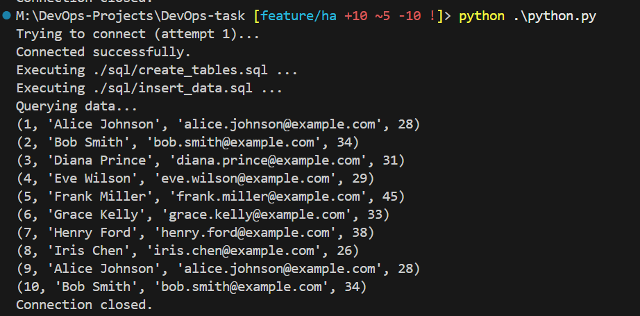
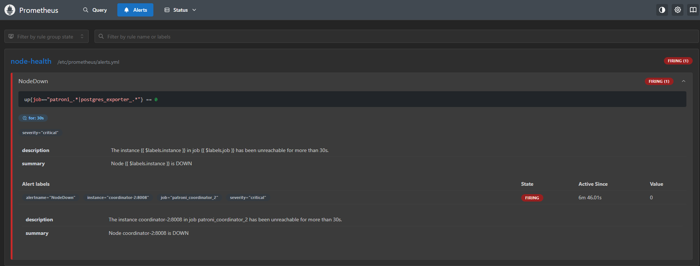

# PostgreSQL Citus Cluster with High Availability & Monitoring

## Overview

This project demonstrates a production-ready Citus (PostgreSQL) cluster deployment with High Availability using Patroni, featuring:

- **Automated leader election and failover** with Patroni
- **Load balancing** through HAProxy
- **Comprehensive monitoring** with Prometheus & Grafana
- **Real-time alerting** via Alertmanager to Slack
- **Python client** for testing distributed operations

   

## Architecture

### Components

1. **Citus Cluster**
   - Coordinator group: 1 Leader + 1 Standby
   - Worker groups: 2 workers, each with Leader + Standby
   - Patroni handles replication, failover, and leader election

2. **HAProxy**
   - Routes traffic to current coordinator leader
   - Ensures seamless client connections during failover

3. **Prometheus**
   - Scrapes metrics from Patroni & PostgreSQL exporters
   - Stores time-series data for monitoring

4. **Alertmanager**
   - Sends alerts to Slack when nodes go down
   - Configurable alert routing and grouping

5. **Grafana**
   - Visualizes cluster health and database performance
   - Pre-configured dashboards for PostgreSQL metrics

6. **Python Client**
   - Tests distributed table operations
   - Validates cluster functionality

## Prerequisites

- Docker and Docker Compose
- Slack Incoming Webhook URL
- Local machine with internet access

## Deployment

### 1. Clone Repository

```bash
git clone https://github.com/mmelmesary/DevOps-task.git
cd DevOps-task
```

### 2. Start the Cluster

```bash
docker-compose up -d
```

**Services started:**
- Coordinator nodes (coordinator-1, coordinator-2)
- Worker nodes (worker1-1, worker1-2, worker2-1, worker2-2)
- HAProxy, Prometheus, Alertmanager, Grafana

*[Screenshot placeholder: Docker containers running status]*

### 3. Verify Cluster Status

```bash
docker exec -it coordinator-1 patronictl -c /etc/patroni.yml list
```

Expected output shows leader/standby roles assigned correctly.


## Testing

### Python Test Script

**Run the script:**
```bash
python test_citus.py
```

**Expected behavior:**
- Inserts test data into distributed table
- Queries and displays data
- Works seamlessly during failover

   

### Failover Testing

1. **Stop coordinator leader:**
   ```bash
   docker stop coordinator-2
   ```

2. **Verify automatic promotion:**
   - Patroni promotes coordinator-1 to leader
   - Python script continues working without changes

   


## Monitoring

### Prometheus

**Access:** http://localhost:9090

**Key query:**
```promql
up{job=~"patroni_.*|postgres_exporter_.*"}
```
- `0` = node down
- `1` = node up


**alerts:**
because we stoped the container of coordinator-2, we should see an alert in the alerts tab



### AlertManager

**Access:** http://localhost:9093


## Slack
we aleady integrated prometheus alertmanager with slack, and the alert should fired at slack channel


### Grafana

**Access:** http://localhost:3000

**Credentials:**
- Username: `admin`
- Password: `admin`

**Features:**
- PostgreSQL performance dashboards
- Cluster health visualization
- Real-time metrics


## Cleanup

```bash
docker-compose down -v
```

## Key Benefits

- **Zero-downtime failover** with Patroni automation
- **Transparent load balancing** via HAProxy
- **Proactive monitoring** with Prometheus/Grafana
- **Instant alerting** for critical issues
- **Production-ready** high availability setup
